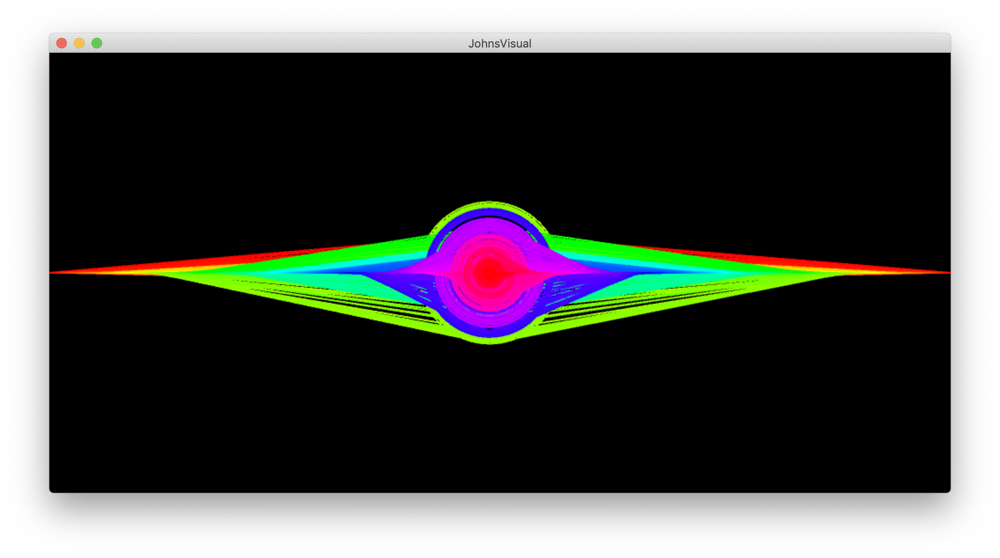
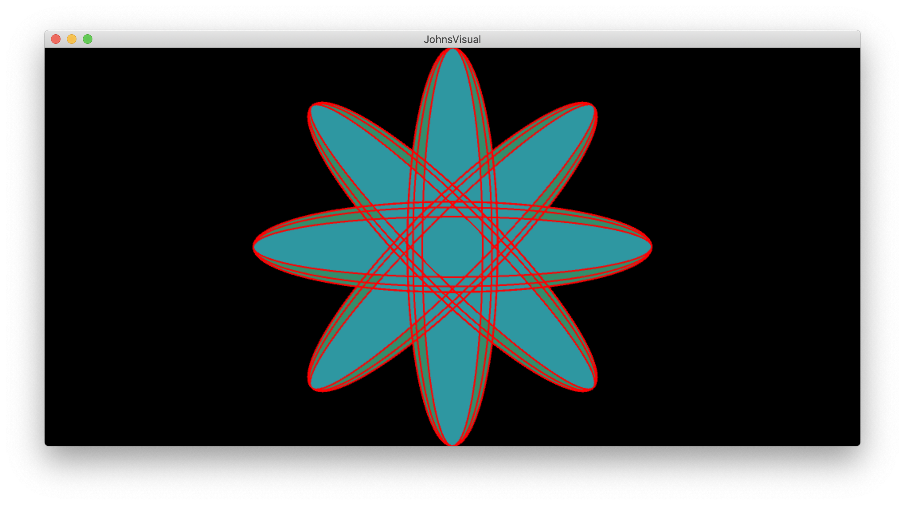
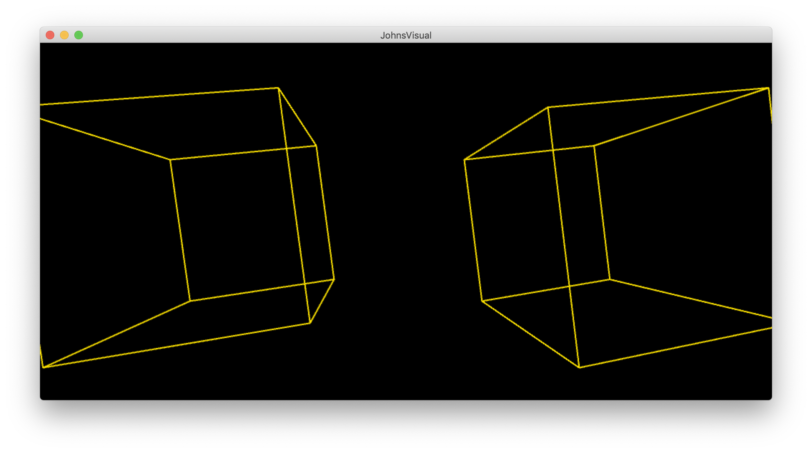
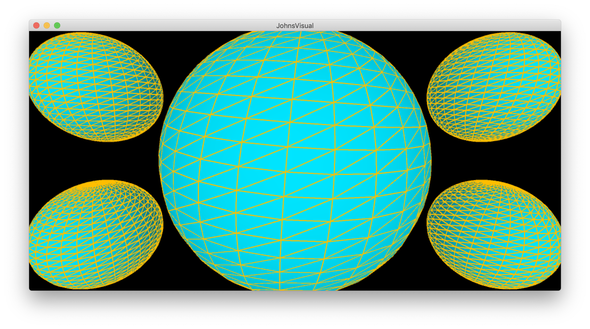
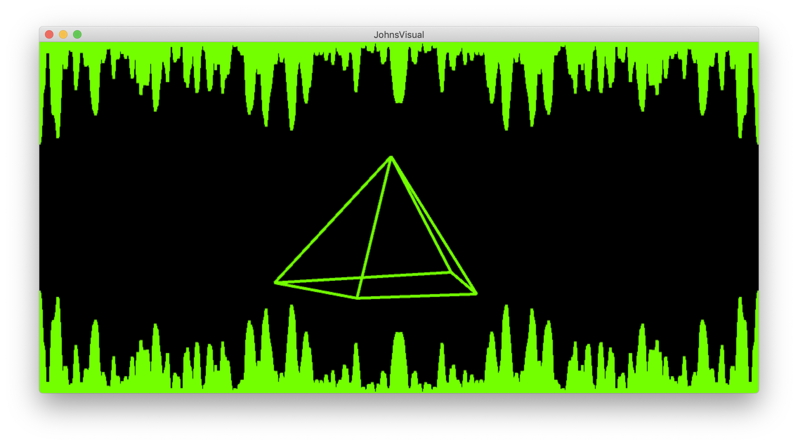
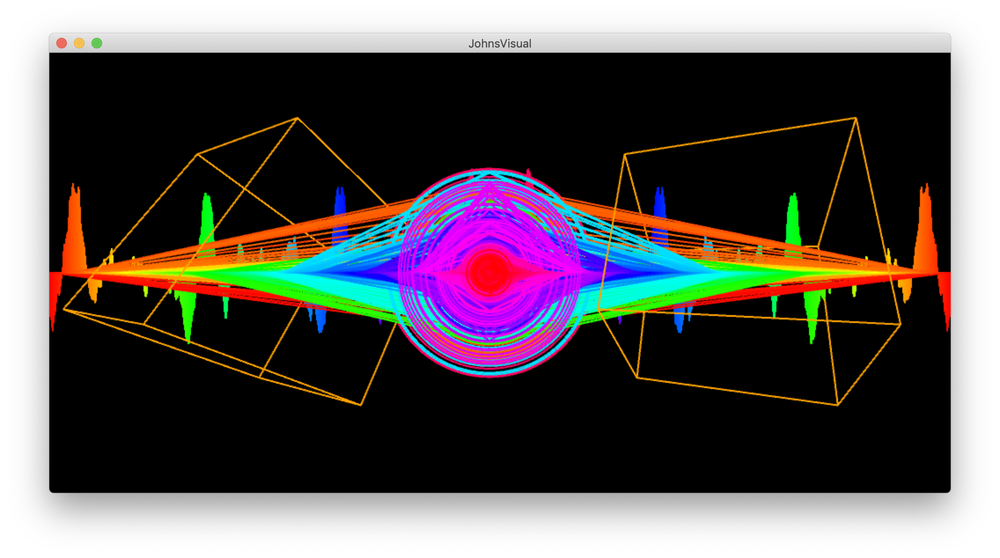
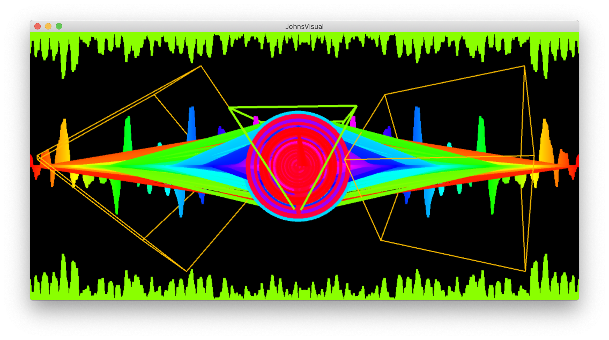

# Music Visualiser Project

Name:   John Quinless

Student Number:     C19312856

# Description of the assignment
For this assignment, we were tasked with creating a music visualizer. I wanted to take this opportunity to express my particular taste in music and introduce more people to my favourite artist, Witt Lowry. His music can be vary from being of a chill vibe to a hyped up vibe. For this reason I wanted to encapsulate this variety by displaying both relaxing visuals, as well as more "intense" visuals. The visuals react to the msuic, both by changing size and colour based on the song of choice, "Put Me First".

# Instructions
The program has a number of visuals that may be selected in accordance to what number was last pressed on the keyboard. 
## The controls are as follows:
- Space Bar - Play/Pause Music
- R/r - Restart the song
- 0 - Basic Audio Band Visual / Show controls
- 1 - Basic Waveform Visual
- 2 - Basic Ellipse and Title Visual
- 3 - Floral Visual
- 4 - Eye Visual
- 5 - Dual Box Visual
- 6 - Sphere Visual
- 7 - Pyramid Visual
- 8 - Mix of Visuals together (Including Eye, Waveform and Box Visuals)

# How it works
The Visual Class uses PApplet to create methods that can be used to read information such as the Amplitude and Frequency Bands of an audio file. The JohnsVisual Class extends this class, thus meaning that it may make use of these methods defined in the Visual class.

The Visuals themselves are housed in their own classes however they are declared in the JohnsVisual class, effectively acting as a hub for each of the visuals. The code below shows the classes being declared in the JohnsVisual class:

```Java
public class JohnsVisual extends Visual
{    
    WaveForm wf;
    AudioBandsVisual abv;
    Circle c;
    MouseCircles mc;
    Eye eye;
    Boxes b;
    Sphere s;
    Bands band;
    Floral f;
    Pyramid p;
    
    ...
}
```

The classes are instantiated in the setup method in order to be used in the JohnsVisual.

```Java
public void setup()
{
    ... 
    
    wf = new WaveForm(this);
    abv = new AudioBandsVisual(this);
    c = new Circle(this);
    mc = new MouseCircles(this);
    eye = new Eye(this);
    b = new Boxes(this);
    s = new Sphere(this);
    band = new Bands(this);
    f = new Floral(this);
    p = new Pyramid(this);

    ...
}
```

Due to the Visual classes being declared in the JohnsVisual class, a constructor is required in each to initialize the objects. A parameter for JohnsVisual is then declared in order to use the variables in JohnsVisual in the Visual class.

```Java
public Pyramid(JohnsVisual jv)
{
    this.jv = jv; 
    
    ...
}
```

A switch statement is used in order to switch between each of the Visuals. The render( ) method of a corresponding Visual is called when a specified key bind is pressed. For this example these key binds are the numbers 0 - 9. A default preset is coded in case the user enters a key bind that isn't 0 - 9. This default preset calls the controls( ) method in order to remind the user of the key binds available.

```Java
switch (which)
{
    case 0:
    {
        abv.render();
        controls();
        break;
    }
    case 1:
    {
        wf.render();
        break;
    }
    case 2:
    {
        c.render();
        putMeFirst();
        break;
    }
    case 3:
    {
        f.render();
        break;
    }
    case 4:
    {
        fill(0);
        eye.render();
        break;
    }
    case 5:
    {
        b.render();
        break;
    }
    case 6:
    {
        s.render();
        break;
    }
    case 7:
    {
        if (key == 's' || key == 'S')
        {
            s.render();
        }
        wf.render();
        c.render();
        eye.render();
        b.render();
        break;
    }
    case 8:
    {
        p.render();
        break;
    }
    default:
    {
        controls();
    }
}
```


# What I am most proud of in the assignment

I am most proud of the variety of Visuals and the visible progression of the visuals as I worked through the assignment. I took my time with this assignment as it was enjoyable to create beautiful visuals that are used to encapsulate the emotions of ones selected song. Being a fan of music it was great being able to translate this passion into the form of another passion of mine, coding. Unfortunately due to other assignments and other things going on in life I couldn't further explore this, however during the summer I hope to perhaps start my own projects in my free time.

The program presents an evident progression in its complexity as one cycles through the index of the visuals. This culminates in a combination of a few of these visuals together, which I believe is a perfect way to display to feeling of the song "Put me First". As discussed in the Description of the assignment, I used the example visuals as a baseline for the rest of my visuals, adding more complex shapes as we advanced in our lectures.

The "Eye" Visual is perhaps the most unique visuals in the assignment. It resonated within me when I created it as I see music to be something that allows someone to take a metaphorical "look" into someone else's mind, to experience their feelings.



The "Floral" Visual represents the sense of rebirth as the song speaks of moving past an experience and finally putting themselves first over others. I drew inspiration from a video linked in the assignment overview for this visual while researching for the assignment (C18356933).



A sense of minimalism presented by the "Cube" Visual gives a sense of a clean slate, as the musician looks to move onto a new chapter in his life.



This feeling is contrasted by the "Sphere" and "Pyramid" Visuals as they can be seen to display a sense of organised chaos. This could be shown to represent life, particularly it's ups and downs.





The final Visual is a combination of a few of the previous visuals. It represents ones experiences of life. Within all the chaos, if one takes a step back and looks at things individually they may seem a lot more understandable, and thus more peaceful.






# Markdown Tutorial

This is *emphasis*

This is a bulleted list

- Item
- Item

This is a numbered list

1. Item
1. Item

This is a [hyperlink](http://bryanduggan.org)

# Headings
## Headings
#### Headings
##### Headings

This is code:

```Java
public void render()
{
	ui.noFill();
	ui.stroke(255);
	ui.rect(x, y, width, height);
	ui.textAlign(PApplet.CENTER, PApplet.CENTER);
	ui.text(text, x + width * 0.5f, y + height * 0.5f);
}
```

So is this without specifying the language:

```
public void render()
{
	ui.noFill();
	ui.stroke(255);
	ui.rect(x, y, width, height);
	ui.textAlign(PApplet.CENTER, PApplet.CENTER);
	ui.text(text, x + width * 0.5f, y + height * 0.5f);
}
```

This is an image using a relative URL:


This is an image using an absolute URL:


This is a youtube video:

[](https://www.youtube.com/watch?v=J2kHSSFA4NU)

This is a table:

| Heading 1 | Heading 2 |
|-----------|-----------|
|Some stuff | Some more stuff in this column |
|Some stuff | Some more stuff in this column |
|Some stuff | Some more stuff in this column |
|Some stuff | Some more stuff in this column |

